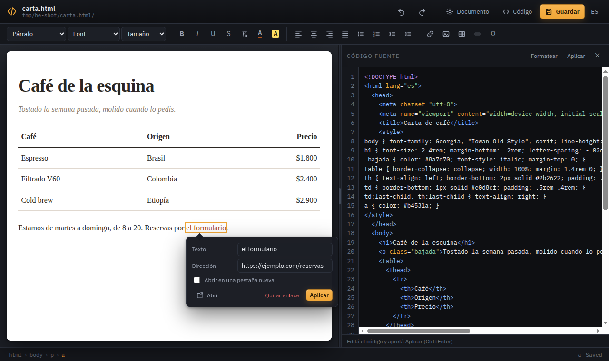

# html-editor

*[Read in English](README.md)*

Un editor visual para los archivos HTML que ya tenés en tu carpeta. Un solo
binario en Go, sin runtime, sin proyecto que configurar, sin base de datos: lo
ejecutás, se abre el navegador, editás la página como si fuera un documento, y
un par de segundos después el archivo del disco cambia solo.

```bash
cd micarpeta
html-editor miarchivo.html      # se abre el navegador en ese archivo
```

Cerrás la pestaña y el comando termina unos segundos después, como cualquier
herramienta de escritorio que se porte bien.



## Para qué

Editar una página estática chica suele significar o escribir HTML a mano o meter
un constructor de sitios entero en el medio. `html-editor` está en el medio de
esos dos extremos: edita **el archivo que ya tenés**, en su lugar, respetando su
estructura, su hoja de estilos y sus imágenes. La carpeta sigue siendo
publicable tal cual está.

## Instalación

Necesita Go 1.21 o posterior.

```bash
git clone https://github.com/neitanod/html-editor.git
cd html-editor
make install          # compila y deja el symlink en ~/bin
```

`make install` crea un symlink, así que un `make build` posterior actualiza
también el comando instalado. Para instalarlo para todo el sistema:
`PREFIX=/usr/local/bin sudo make install`. O simplemente `make build` y poné el
binario donde te guste.

## Uso

```
html-editor [OPCIONES] [ARCHIVO]
```

| | |
|---|---|
| `html-editor` | edita `index.html` en la carpeta actual |
| `html-editor about.html` | edita ese archivo |
| `html-editor docs/guia.html` | edita un archivo en otra carpeta |
| `html-editor recetas` | edita `recetas/index.html` |
| `html-editor recibido.mhtml` | desempaqueta el archivo en `recibido/` y lo edita |

**Un nombre con extensión es un archivo; uno sin extensión es una carpeta**, y
lo que se edita es su `index.html`. Ese es el atajo para mantener cada documento
junto con sus imágenes: todo lo que pegás cae en esa misma carpeta, así se puede
publicar, comprimir o mover como una unidad.

Un documento que todavía no existe abre con el esqueleto completo: `<!DOCTYPE
html>`, `<html lang>`, un `<head>` con charset, viewport y título, y una hoja de
estilos por defecto legible. No se escribe nada hasta que lo editás: la carpeta
y el archivo los crea el primer cambio, así que abrir un nombre para mirarlo y
cerrar la pestaña no deja rastro. Un `index.html` que todavía no está en el
disco toma el título del nombre de la carpeta.

### Opciones

| Flag | Qué hace |
|---|---|
| `--port <n>` | Puerto del servidor local (por defecto: el primero libre desde 8477) |
| `--host <dir>` | Dirección de bind (por defecto `127.0.0.1`, `0.0.0.0` con `--serve`) |
| `--serve` | Modo servidor: no abre el navegador ni se cierra solo — sirve para systemd |
| `--read-only` | Deshabilita todos los endpoints de escritura |
| `--no-browser` | Arranca normal pero sin abrir el navegador |
| `--dev <dir>` | Sirve la UI desde una carpeta de código en vez de la copia embebida |
| `--export-mhtml` | Empaqueta el documento en un `.mhtml` y termina |
| `--version` | Muestra la versión |

## Qué hace

**WYSIWYG que es la página de verdad.** El documento se sirve desde su propia
carpeta y se muestra en un iframe, así que su hoja de estilos, sus fuentes y sus
imágenes relativas se ven igual que cuando abrís el archivo directamente. Los
scripts del documento quedan aparcados mientras editás y se restauran intactos
al guardar.

**Guardado automático.** Dos segundos después de que dejás de cambiar algo, el
documento se escribe en el disco — y si no parás nunca, se escribe igual cada
diez segundos. Lo hace callado: el único indicio son la barra de estado y el
punto al lado del nombre del archivo, y sólo aparece un aviso si una escritura
falla. `Ctrl+S` y el botón *Guardar* siguen funcionando y siguen confirmando;
están para cuando querés asegurarte, y ya no porque algo dependa de ellos. Al
irte de la pestaña, ocultarla o cerrarla se escribe lo que quedaba pendiente.
Con `--read-only` no se escribe nada.

**Vista dividida con el código.** Apretá *Código* (o `Ctrl+Shift+E`) para ver el
HTML generado al lado de la página, coloreado y editable. Aplicar empuja tus
cambios al lado visual, y el lado visual mantiene el código sincronizado
mientras escribís.

**Las imágenes pegadas se guardan, no se incrustan.** Pegás o soltás una imagen
y se escribe junto al documento con un nombre único, referenciada de forma
relativa (``), nunca como un data URL de varios megas.
Arrastrás los tiradores para redimensionarla: mantiene el aspect ratio salvo que
tengas *Shift* apretado.

**Recortar, rotar y enderezar.** Seleccionás una imagen y la barra que aparece
arriba la gira un cuarto de vuelta para cualquier lado; *Recortar y rotar* abre
un diálogo con un marco que arrastrás sobre la foto, proporciones fijas (1:1,
4:3, 3:4, 16:9 o la original), espejado horizontal y vertical, y una regla para
enderezar un horizonte torcido, que encoge el encuadre sola para que no entren
las esquinas vacías que deja el giro. El resultado se hornea en el archivo y el
HTML queda tan simple como estaba, sin envoltorios ni `transform`. Un SVG se
deja en paz, porque recortar formas convirtiéndolas en píxeles es un downgrade
disfrazado de edición; y una imagen que todavía vive en otro sitio primero te
ofrece la descarga que la trae a la carpeta.

**Guardar copia o sobreescribir, vos elegís.** El diálogo cierra con los dos
botones. *Guardar copia* escribe un archivo nuevo al lado y deja el original
donde estaba, así que Ctrl+Z te devuelve la imagen que tenías. *Sobreescribir*
pisa el archivo del que salió la imagen, que es lo que evita que la carpeta
junte una foto por cada retoque; ahí el deshacer te devuelve el documento y los
píxeles viejos ya se fueron. Sobreescribir está disponible para PNG y JPEG, los
dos formatos que el editor vuelve a escribir: un `.gif` o un `.webp` saldrían
convertidos en PNG y el nombre del archivo pasaría a mentir, así que en esos
casos queda la copia sola.

**La imagen pegada se encuadra antes de aterrizar.** Una captura casi siempre
trae más de lo que importa, así que `Ctrl+V` abre ese mismo diálogo sobre lo que
pegaste, antes de escribir nada: sólo lo que encuadrás termina siendo un archivo
en la carpeta. *Pegarla entera* —o Escape— la guarda tal cual, porque el pegado
nunca estuvo en discusión. Si pegás varias imágenes de una, el diálogo no
aparece y se guardan todas.

**Anotar lo que la imagen tiene que mostrar.** *Anotar* dibuja encima números en
círculo, recuadros, elipses, líneas y flechas, cada uno con su color de borde,
su color de fondo, su grosor, sus esquinas redondeadas y su sombra, y difumina
las zonas que no tienen por qué publicarse, con fuerza suficiente para que sea
una decisión y no una sugerencia. Los números se numeran solos en el orden en
que los ponés, así el párrafo de abajo puede decir "el error está en el 2".

Se dibuja arrastrando; tocar una marca la agarra, la mueve y le adopta el
estilo como un gotero, y una ✕ encima (o `Supr`) la saca. Con *Shift* el
recuadro sale cuadrado y la línea se traba en octavos de vuelta, y `Ctrl+Z` /
`Ctrl+Y` recorren cada gesto. Las marcas se hornean en el archivo como cualquier
otra edición de imagen —con los mismos dos botones para terminar, copia o
sobreescritura—: lo que mandás es una imagen, y se ve igual donde sea que la
abran.

**Doble clic en una imagen para verla en grande.** Ocupa toda la pantalla, la
ruedita acerca apuntando al cursor, arrastrás para recorrer lo que ya no entra y
un doble clic alterna entre encajar y tamaño real. Desde ahí el documento se lee
como una galería: las flechas de los costados, y las teclas izquierda y derecha,
pasan por todas las demás imágenes en el orden en que están en la página, y
Escape cierra sobre la que estabas mirando, ya seleccionada. El menú del botón
derecho ofrece además *Abrir la imagen en una pestaña nueva*, que sigue la
dirección que la página está usando de verdad: un archivo que está junto al
documento se abre desde su carpeta, y uno que todavía vive en otro sitio se
abre allá.

**El contenido pegado de la web puede traerse sus imágenes.** Cuando lo que
pegás enlaza imágenes alojadas en otro sitio, el editor pregunta si lo querés
pegar tal cual o bajar esos recursos: se guardan junto al documento y se
enlazan de forma relativa, así la carpeta no depende de un sitio que no
controlás. Cubre `src`, `srcset`, `poster` y las `url()` de los estilos inline,
y el mismo comando está disponible para todo el documento desde el menú
contextual del fondo (*Descargar los recursos externos*). Un recurso que no se
puede bajar conserva su dirección original en vez de romper el resto.

**Un solo archivo para mandar: `.mhtml`.** Una carpeta es la forma correcta para
trabajar y la incorrecta para mandar por mail. *Exportar a .mhtml* empaqueta el
documento con sus imágenes y sus hojas de estilo en un archivo único —la "página
web de un solo archivo" de Chrome, Edge y Word— e *Importar un .mhtml* lo
desempaqueta de vuelta en la carpeta, así lo que te mandaron queda editable con
todo lo demás que hay acá. Es un mail (RFC 2557) y no un zip: texto plano que
podés leer con un pager, con los binarios en base64. Las direcciones que apuntan
a otros sitios siguen siendo remotas, y nada del archivo revela en qué parte de
tu disco vive la carpeta.

Desde la consola funciona sin abrir el editor:

```
html-editor --export-mhtml recetas   # escribe recetas/index.mhtml
html-editor recibido.mhtml           # lo desempaqueta en ./recibido/ y lo abre
```

**Enlaces que se pueden editar.** Hacés click en un enlace y aparece un panel
arriba o abajo —donde entre— con el texto legible, la dirección, un interruptor
de "pestaña nueva", un botón para *quitar el enlace* y otro para *abrirlo* en
otra pestaña.

**Click derecho en todo.** Copiar, cortar, duplicar, borrar, envolver en un
contenedor, seleccionar el padre, copiar el HTML, saltar al elemento en el
código y abrir sus propiedades. El click derecho en el fondo te da lo mismo para
`<body>`, más los metadatos del `<head>` y el elemento `<html>`.

**Propiedades sin saber HTML.** El inspector edita tipografías, tamaños,
colores, alineación, bordes, padding, márgenes, fondos, tamaño, posición y
efectos con controles de formulario de verdad, y al lado tenés la tabla cruda de
atributos para cuando sí sabés lo que estás haciendo. Los ajustes del documento
cubren el título, el charset, el viewport, la descripción, el autor, el favicon
y las etiquetas de Open Graph.

**Notas, citas y bloques de código.** Seleccionás un texto, apretás el botón y
queda en un recuadro con estilo propio: una nota al costado, una cita con su
línea de fuente, o un bloque de código en monoespaciada sobre fondo oscuro. El
estilo de cada tipo viaja en el documento, en su propia etiqueta con un id fijo
—`html-editor-notes-styles`, `html-editor-citation-styles` y
`html-editor-sourcecode-styles`—, que se escribe la primera vez que usás ese
bloque y no se vuelve a tocar: lo que retoques ahí queda tuyo, y todos los
bloques del mismo tipo lo siguen. Apretar el mismo botón desde adentro de un
recuadro lo saca y devuelve el contenido al documento.

**Tablas como en un procesador de texto.** Se insertan con una grilla que se
previsualiza al pasar el mouse, y después podés agregar y borrar filas y
columnas, unir y dividir celdas, activar la fila de encabezado, redimensionar
columnas arrastrando y moverte entre celdas con Tab.

**Interfaz bilingüe.** Castellano e inglés, se cambia desde arriba a la derecha.

### Teclado

| | |
|---|---|
| `Ctrl+S` | Guardar |
| `Ctrl+Z` / `Ctrl+Y` | Deshacer / rehacer |
| `Ctrl+B` `Ctrl+I` `Ctrl+U` | Negrita, cursiva, subrayado |
| `Ctrl+K` | Insertar o editar un enlace |
| `Ctrl+Shift+E` | Mostrar u ocultar el código |
| `Ctrl+Shift+V` | Pegar como texto plano |
| `Ctrl+Enter` | Aplicar el código al documento |

## Seguridad de tus archivos

El primer guardado de cada sesión copia el archivo que encontró en el disco a
`<archivo>.bak`, y de ahí en más el guardado automático escribe encima del
documento sin tocar esa copia: el respaldo se queda en la versión que abriste,
por muchas veces que se escriba después. Los guardados son atómicos: el contenido nuevo va a un archivo
temporal en la misma carpeta y se renombra sobre el original, así que un
guardado interrumpido nunca te trunca el documento. El servidor sólo lee y
escribe dentro de la carpeta del archivo que abriste, y escucha en `127.0.0.1`
salvo que le pidas otra cosa.

## Desarrollo

```
main.go        flags de la CLI, resolución del documento, arranque del servidor
server.go      tracking de clientes SSE, auto-shutdown, búsqueda de puerto
app.go         rutas HTTP: shell, /doc/, /api/document, /api/assets, /api/stream
document.go    creación del archivo, guardado atómico, aparcado de scripts
templates/     el shell del editor (embebido)
static/        módulos css y js (embebidos)
```

Todo es librería estándar de Go y JavaScript vanilla sin dependencias; el
frontend no tiene build. `make build` produce el binario único.

## Licencia

MIT — ver [LICENSE](LICENSE).
